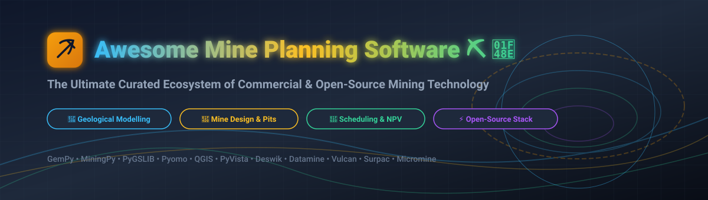

# ⛏️ Awesome Mine Planning Software 💎

<p align="center">
  
</p>

<p align="center">
  <a href="https://github.com/ishandutta2007/Awesome-Awesome-Awesome"></a><a href="https://discord.gg/jc4xtF58Ve"></a>
  <a href="https://github.com/ishandutta2007/Awesome-Mine-Planning-Software"></a>
  <a href="https://github.com/ishandutta2007/Awesome-Mine-Planning-Software/network/members"></a>
  <a href="https://github.com/ishandutta2007/Awesome-Mine-Planning-Software/blob/main/LICENSE"></a>
  <a href="https://github.com/ishandutta2007"></a>
</p>

## 🌋 Top Mine Planning Software & Mining Engineering Ecosystem 🏗️

### 📐 Comprehensive Mine Planning, Geological Modelling, Mine Design, Pit Optimization, Production Scheduling & Open-Source Software Stacks

> 🌟 A curated ecosystem of commercial / SaaS / hosted mine-planning platforms and **open-source software, libraries, frameworks and tools** for 3D geological modelling, mineral resource estimation, block modelling, open-pit optimization, underground mine design, Gantt scheduling, haulage simulation, production planning, scientific 3D visualization, and mine economics.

**Primary emphasis:** Open-source alternatives, composable Python stacks, and enterprise mining technology integration.

📅 **Last Updated:** September 2026

---


## Table of Contents


* [Overview](#overview)

* [SaaS/Hosted Platforms](#saashosted-platforms)

  * [Platform Comparison Table](#saashosted-platform-comparison)

  * [Additional Commercial Platforms](#additional-commercial-platforms)

* [Open-Source Ecosystem](#open-source-ecosystem)

  * [Open-Source Repositories (Sorted by Stars)](#open-source-repositories-sorted-by-stars)

* [Commercial → Open-Source Mapping](#commercial--open-source-mapping)

* [Mine Planning Capability Matrix](#mine-planning-capability-matrix)

* [Recommended Open-Source Architecture](#recommended-open-source-architecture)

* [Best Open-Source Combinations](#best-open-source-combinations)

* [Mine Planning Lifecycle](#mine-planning-lifecycle)

* [Geological Modelling Workflow](#geological-modelling-workflow)

* [Resource Estimation Workflow](#resource-estimation-workflow)

* [Block Model Workflow](#block-model-workflow)

* [Open-Pit Planning Workflow](#open-pit-planning-workflow)

* [Underground Planning Workflow](#underground-planning-workflow)

* [Scheduling Architecture](#scheduling-architecture)

* [Optimization Architecture](#optimization-architecture)

* [Mine Data Architecture](#mine-data-architecture)

* [Digital Twin Architecture](#digital-twin-architecture)

* [Analytics & Visualization](#analytics--visualization)

* [Scenario Management](#scenario-management)

* [Uncertainty & Risk Analysis](#uncertainty--risk-analysis)

* [Mine Planning APIs](#mine-planning-apis)

* [Open Mining Data Standards](#open-mining-data-standards)

* [Suggested Open-Source Technology Stack](#suggested-open-source-technology-stack)

* [Example Open-Source Mine Planning Flow](#example-open-source-mine-planning-flow)

* [Reference Enterprise Architecture](#reference-enterprise-architecture)

* [Multi-Mine Planning Architecture](#multi-mine-planning-architecture)

* [Open-Source Maturity](#open-source-maturity)

* [What Open Source Can Replace](#what-open-source-can-replace)

* [What Open Source Does Not Automatically Replace](#what-open-source-does-not-automatically-replace)

* [Testing & Validation](#testing--validation)

* [Security & Governance](#security--governance)

* [Recommended Open-Source Mine Planning Stack](#recommended-open-source-mine-planning-stack)

* [Key Takeaway](#key-takeaway)

* [How to Contribute](#how-to-contribute)

* [Support & Community](#support--community)

* [Useful Resources](#useful-resources)

* [Disclaimer](#disclaimer)

* [Summary](#summary)

* [Star History](#-star-history)


---


# Overview


Mine planning software combines:


* Geological data management

* Drillhole management

* Geological interpretation

* 3D geological modelling

* Geostatistics

* Mineral resource estimation

* Block modelling

* Economic modelling

* Pit optimization

* Underground optimization

* Mine design

* Pushback / phase design

* Stope optimization

* Cut-off grade analysis

* Production scheduling

* Long-range planning

* Medium-range planning

* Short-term planning

* Equipment scheduling

* Haulage modelling

* Stockpile management

* Blending

* Processing constraints

* NPV optimization

* Scenario analysis

* Risk analysis

* 3D visualization

* GIS integration

* Survey integration

* Reporting

* Data governance

* Digital twins


Commercial platforms such as Deswik, Datamine, Micromine, GEOVIA Surpac, Maptek Vulcan, Hexagon MinePlan, Leapfrog Geo, RPMGlobal and Carlson provide highly integrated mining workflows.


The open-source ecosystem is different.


Instead of one complete open-source replacement, organizations can assemble a modular platform from:


```text

GemPy

   ↓

PyGSLIB / GeostatsPy

   ↓

MiningPy

   ↓

Block Model

   ↓

Optimization Libraries

   ↓

Custom Mine Scheduling

   ↓

PyVista / VTK

   ↓

QGIS / GRASS GIS

   ↓

PostgreSQL / PostGIS

   ↓

Web APIs / Dashboards

```


This makes open source particularly useful for:


* Research

* Universities

* Mining technology teams

* Custom workflows

* Automation

* Reproducible resource estimation

* Data engineering

* Optimization research

* Mine-planning prototypes

* Digital-twin development

* Integration with commercial mining systems


---


# SaaS/Hosted Platforms

> This section is intentionally separate from the Open-Source section.

**Market Size & Industry Structure:**
The global mine planning and mining software market is estimated at **$2.5 Billion – $3.2 Billion USD** (2025/2026), expected to grow at a CAGR of ~8.5% driven by digital transformation, automation, and ESG compliance requirements. The sector is **moderately concentrated to highly consolidated**, led by dominant enterprise industrial conglomerates and dedicated mining tech holdings (Dassault Systèmes, Hexagon, Sandvik, Bentley Systems, Constellation Software/Vela, and The Weir Group), alongside niche specialized players.

## SaaS/Hosted Platform Comparison

| Platform | Parent / Owner | Market Size / Company Valuation | Pricing (Starting Tier / Plan) | Free Tier / Trial Limit | Category & Major Capabilities | Website |
| :--- | :--- | :--- | :--- | :--- | :--- | :--- |
| **GEOVIA Surpac** | Dassault Systèmes (Euronext: DSY) | **$30.9B USD Market Cap** (€27.0B / €6.24B Annual Revenue) | Custom Enterprise Quote (Module-based license from ~$12,000/seat/yr) | 14-day evaluation license available upon request | Geological Modelling & Mine Planning (Database management, wireframing, block modelling, geostatistics, underground/open-pit design) | [3ds.com/surpac](https://www.3ds.com/products/geovia/surpac) |
| **MineSched** | Dassault Systèmes (Euronext: DSY) | **$30.9B USD Market Cap** (€27.0B / €6.24B Annual Revenue) | Custom Enterprise Quote (Scheduling tier starting ~$10,000/seat/yr) | Guided software demo & short-term evaluation trial upon sales request | Mine Scheduling (Open-pit & underground scheduling, resource allocation, blending, Gantt sequencing) | [3ds.com/minesched](https://www.3ds.com/products/geovia/minesched) |
| **Hexagon MinePlan** | Hexagon AB (Nasdaq Stockholm: HEXA B) | **$25.6B USD Market Cap** (€5.4B Annual Revenue) | Custom Enterprise Quote (Modular subscription from ~$15,000/yr) | Software demonstration & site evaluation license on request | Geological Modelling, Mine Planning & Optimization (Resource modelling, pit optimization, equipment scheduling) | [hexagon.com](https://hexagon.com/) |
| **Leapfrog Geo** | Bentley Systems (Nasdaq: BSY) / Seequent | **$9.5B USD Market Cap** (Acquired Seequent for $1.05B USD) | Custom Quote (~$8,000–$15,000/yr per seat; day-based licensing options) | **14-day full feature free trial** upon application | 3D Geological Modelling (Implicit modelling, drillhole interpretation, structural geology, wireframing) | [seequent.com/leapfrog-geo](https://www.seequent.com/products-solutions/leapfrog-geo/) |
| **Datamine (Studio OP/RM/NPVS)** | Constellation Software / Vela Software (TSX: CSU) | **$8.5B+ USD Market Cap** (Parent CSU; $2.5B+ Group Revenue) | Custom Enterprise Quote (Modular licenses starting ~$10,000/yr) | Free data viewers (Datamine Discover Viewer); full product evaluation trial upon request | Geological Modelling, Mine Planning & Scheduling (Resource estimation, pit optimization, pushback generation, haulage) | [dataminesoftware.com](https://dataminesoftware.com/) |
| **Micromine** | The Weir Group (LSE: WEIR) | **$1.65B USD Valuation** (Acquired for £657M / A$1.31B; ~£68M Revenue) | Custom Subscription Quote (Explorer bundles starting ~$6,000/yr) | **30-day trial evaluation period** available upon site request | Geological Modelling, Mine Design & Scheduling (Exploration, resource estimation, production planning, 3D visualization) | [micromine.com](https://www.micromine.com/) |
| **RPMGlobal XERAS** | Caterpillar Inc. (NYSE: CAT) | **$1.1B AUD Valuation** (Acquired by Caterpillar for A$1.1B) | Custom Enterprise Quote (Financial software suites from ~$12,000/yr) | Interactive demo & site pilot trial upon enterprise request | Mine Economics, Forecasting & Financial Planning (Budgeting, cost analysis, scenario optimization, NPV modeling) | [rpmglobal.com](https://rpmglobal.com/) |
| **Deswik** | Sandvik AB (Nasdaq Stockholm: SAND) | **$850M USD Valuation** (Acquired by Sandvik; ~A$79M Annual Revenue) | Custom Enterprise Quote (Modular licenses starting ~$5,000–$15,000/yr) | Free 3D file viewers (Deswik.vCAD & Deswik.vSched); 3-day training licenses | Mine Design, Planning, Scheduling & Optimization (Underground & surface design, Gantt scheduling, haulage, NPV optimization) | [deswik.com](https://www.deswik.com/) |
| **Maptek Vulcan** | Maptek (Privately Held) | **~$175M USD Revenue** (Est. valuation $350M–$500M USD) | Custom Enterprise Quote (Modules starting ~$10,000–$25,000/yr) | Customized sandbox demo & pilot site trial upon sales request | 3D Geological Modelling, Mine Design & Planning (Geostatistics, drill & blast, grade control, reserves estimation) | [maptek.com/vulcan](https://www.maptek.com/products/vulcan/) |
| **Carlson Mining** | Carlson Software (Privately Held) | **~$84M USD Revenue** (Est. valuation $150M–$250M USD) | Standalone Module Perpetual License starting at **$3,495 USD** | **30-day fully functional trial version** available for download | Survey, Mine Design & Mining Engineering (Surface/underground survey, volumetrics, terrain modelling, CAD) | [carlsonsw.com](https://www.carlsonsw.com/) |

---


# Additional Commercial Platforms

Other commercial products and ecosystems relevant to mine planning include:

| Platform | Primary Area | Product Ecosystem / Owner |
| :--- | :--- | :--- |
| **GEOVIA Whittle** | Open-Pit Mine Optimization | Dassault Systèmes |
| **GEOVIA MineSched** | Mine Production Scheduling | Dassault Systèmes |
| **Hexagon MinePlan** | Life-of-Mine Engineering & Operations | Hexagon AB |
| **Maptek Evolution** | Strategic Mine Scheduling & Haulage | Maptek |
| **Datamine Studio OP** | Open-Pit Design & Planning | Constellation Software / Vela |
| **Datamine Studio NPVS** | Strategic Pit Optimization & NPV | Constellation Software / Vela |
| **Datamine Studio UG** | Underground Mine Design | Constellation Software / Vela |
| **Deswik Planning** | Gantt Production Scheduling | Sandvik AB |
| **Deswik APEX** | Strategic Mine Optimization | Sandvik AB |
| **Deswik OPS** | Operational Shift Planning | Sandvik AB |
| **Micromine Origin** | Geological Modelling & Exploration | The Weir Group |
| **Micromine Beyond** | Mine Design & Production Planning | The Weir Group |
| **Leapfrog Geo** | Implicit 3D Structural Modelling | Bentley Systems / Seequent |
| **Leapfrog Works** | Civil & Subsurface Infrastructure | Bentley Systems / Seequent |
| **RPM MinePlanner** | Mine Design & Production Planning | Caterpillar Inc. / RPMGlobal |
| **RPM XERAS** | Financial Modeling & Cost Forecasting | Caterpillar Inc. / RPMGlobal |
| **Carlson Mining** | Mining CAD, Volumetrics & Surveying | Carlson Software |
| **Minemax Scheduler** | Strategic Mine & Schedule Optimization | Minemax |
| **Minemax Studio** | Haulage & NPV Schedule Optimization | Minemax |


---


# Open-Source Ecosystem

> **Important:** There is currently no single open-source package that reproduces the entire integrated feature set of Deswik, Datamine, Vulcan, Surpac, MinePlan or Micromine.
> The strongest open-source strategy is **compositional**—combining specialized open-source tools and libraries into a reproducible, API-driven mining technology stack.

## Open-Source Repositories (Sorted by Stars)

| Repository | Stars | Primary Category / Focus | Key Capabilities & Description | Link |
| :--- | :--- | :--- | :--- | :--- |
| **scikit-learn** | [](https://github.com/scikit-learn/scikit-learn/stargazers) | Machine Learning & Geostatistics | Domain clustering, lithology classification, Gaussian Process regression, and grade prediction | [scikit-learn.org](https://scikit-learn.org/) |
| **SciPy** | [](https://github.com/scipy/scipy/stargazers) | Scientific Computing & Spatial Interpolation | Spatial data structures (KDTree, Voronoi), RBF/spline interpolation, and matrix solvers for kriging | [scipy.org](https://scipy.org/) |
| **QGIS** | [](https://github.com/qgis/QGIS/stargazers) | GIS & Spatial Data Analysis | Mine lease boundaries, surface infrastructure, terrain analysis, drillhole locations, and spatial survey data | [qgis.org](https://qgis.org/) |
| **OR-Tools** | [](https://github.com/google/or-tools/stargazers) | Constraint Optimization & Scheduling | Fleet routing, production scheduling, equipment assignment, integer programming, and constraint solvers | [developers.google.com/optimization](https://developers.google.com/optimization) |
| **Open3D** | [](https://github.com/isl-org/Open3D/stargazers) | 3D Mesh Processing & Point Clouds | Point cloud processing, 3D surface reconstruction, mesh analysis, and interactive 3D visualization | [open3d.org](http://www.open3d.org/) |
| **CVXPY** | [](https://github.com/cvxpy/cvxpy/stargazers) | Mathematical Optimization & Modeling | Convex optimization, mathematical modeling, blending constraints, and economic objective formulation | [cvxpy.org](https://www.cvxpy.org/) |
| **GDAL** | [](https://github.com/OSGeo/gdal/stargazers) | Geospatial Data Translation | Geospatial raster/vector processing, coordinate system transformations, and terrain DEM data conversion | [gdal.org](https://gdal.org/) |
| **CGAL** | [](https://github.com/CGAL/cgal/stargazers) | 3D Computational Geometry | C++ 3D mesh processing, convex hulls, Delaunay triangulation, and Boolean operations on pit/stope solids | [cgal.org](https://www.cgal.org/) |
| **GeoPandas** | [](https://github.com/geopandas/geopandas/stargazers) | GIS Data Engineering | Spatial vector data frames, drillhole collar coordinates, lease geometry operations, and GIS mapping | [geopandas.org](https://geopandas.org/) |
| **Pyomo** | [](https://github.com/Pyomo/pyomo/stargazers) | Strategic Mine Planning Optimization | LP/MILP algebraic modeling, strategic mine production scheduling, blending, and NPV optimization | [pyomo.org](https://www.pyomo.org/) |
| **PyVista** | [](https://github.com/pyvista/pyvista/stargazers) | 3D Visualization & Mesh Analysis | 3D block model rendering, geological surface wireframing, pit shell visualization, and VTK mesh export | [pyvista.org](https://docs.pyvista.org/) |
| **VTK** | [](https://github.com/Kitware/VTK/stargazers) | Scientific Visualization Infrastructure | Core 3D graphics, volume rendering, mesh processing pipeline, and scientific visualization engine | [vtk.org](https://vtk.org/) |
| **ParaView** | [](https://github.com/Kitware/ParaView/stargazers) | Large-Scale 3D Mine Visualization | Multi-platform post-processing, massive 3D block model rendering, and simulation visualization | [paraview.org](https://www.paraview.org/) |
| **Rasterio** | [](https://github.com/rasterio/rasterio/stargazers) | Surface DEM & Topographic Analysis | Geospatial raster I/O, topographic DEM elevation grids, and surface mine terrain data processing | [rasterio.readthedocs.io](https://rasterio.readthedocs.io/) |
| **HiGHS** | [](https://github.com/ERGO-Code/HiGHS/stargazers) | Mathematical Optimization Solver | Fast open-source LP / MILP solver for large-scale production scheduling and pit optimization models | [highs.dev](https://highs.dev/) |
| **GemPy** | [](https://github.com/gempy-project/gempy/stargazers) | 3D Geological & Structural Modelling | Implicit 3D geological modelling, fault networks, fold structures, surface generation, and uncertainty analysis | [gempy.org](https://www.gempy.org/) |
| **Coin-or Cbc** | [](https://github.com/coin-or/Cbc/stargazers) | Optimization Solver Layer | Open-source mixed integer linear programming (MILP) solver engine for operational mine planning | [github.com/coin-or/Cbc](https://github.com/coin-or/Cbc) |
| **GeostatsPy** | [](https://github.com/GeostatsGuy/GeostatsPy/stargazers) | Geostatistics & Spatial Analysis | Exploratory spatial data analysis, variogram calculation/fitting, ordinary kriging, and SGS simulation | [github.com/GeostatsGuy/GeostatsPy](https://github.com/GeostatsGuy/GeostatsPy) |
| **pyGIMLi** | [](https://github.com/gimli-org/gimli/stargazers) | Geophysical Modelling & Inversion | Multi-threaded finite-element geophysical modeling and inversion for subsurface resource estimation | [gimli.org](https://www.gimli.org/) |
| **SimPEG** | [](https://github.com/simpeg/simpeg/stargazers) | Geophysical Inversion Framework | Geophysical forward modeling and inversion (gravity, magnetic, resistivity) for subsurface geological domains | [simpeg.xyz](https://simpeg.xyz/) |
| **scikit-gstat** | [](https://github.com/mmaelicke/scikit-gstat/stargazers) | Geostatistical Variography | SciPy-backed variogram analysis, directional variograms, and spatial correlation modeling | [mmaelicke.github.io/scikit-gstat](https://mmaelicke.github.io/scikit-gstat/) |
| **PyGSLIB** | [](https://github.com/opengeostat/pygslib/stargazers) | Resource Estimation & Geostatistics | GSLIB Python wrappers, drillhole compositing, desurveying, kriging, and resource estimation validation | [opengeostat.github.io/pygslib](https://opengeostat.github.io/pygslib/) |
| **Open Mining Format (OMF)** | [](https://github.com/gmggroup/omf-python/stargazers) | Mining Data Interchange Format | Open specification and Python API for standardizing 3D mining data interchange across commercial/open systems | [gmggroup.org](https://gmggroup.org/) |
| **MiningPy** | [](https://github.com/miningpy/miningpy/stargazers) | Block Model & Mine Engineering | Block model manipulation, reblocking, model rotation, bench reserve calculations, haulage modeling, and DXF/VTK I/O | [miningpy.readthedocs.io](https://miningpy.readthedocs.io/) |
| **SGeMS** | [](https://github.com/gerwathome/sgems/stargazers) | Geostatistics (Legacy C++) | Stanford Geostatistical Modeling Software for variography, kriging, and sequential simulation algorithms | [github.com/gerwathome/sgems](https://github.com/gerwathome/sgems) |


---


# 13. Scientific Python Ecosystem


A modern open-source mine-planning platform can leverage:


```text

Python

├── NumPy

├── Pandas

├── SciPy

├── xarray

├── Dask

├── Polars

├── scikit-learn

├── PyTorch

├── Jupyter

└── Apache Arrow

```


### Applications


* Resource estimation

* Forecasting

* Grade prediction

* Optimization

* Machine learning

* Uncertainty analysis

* Production analytics

* Scenario analysis


---


# 14. Simulation & Digital Twins


Potential open-source components include:


* SimPy

* Mesa

* AnyLogic-compatible data interfaces

* Python discrete-event simulation

* OpenModelica

* FMI/FMU tooling

* PyVista

* VTK

* Jupyter


### Example


```text

Mine Model

    ↓

Production Simulation

    ↓

Equipment Simulation

    ↓

Haulage Simulation

    ↓

Processing Simulation

    ↓

Financial Model

    ↓

NPV / Risk

```


---


# Commercial → Open-Source Mapping

| Commercial Platform | Major Capability | Open-Source Building Blocks |
| :--- | :--- | :--- |
| **Deswik** | Integrated Mine Planning & Design | MiningPy + Pyomo + QGIS + PyVista |
| **Datamine** | Geological Modelling & Pit Optimization | GemPy + PyGSLIB + MiningPy + Pyomo |
| **Micromine** | Geological Modelling & Scheduling | GemPy + PyGSLIB + MiningPy + Pyomo |
| **GEOVIA Surpac** | Geological Modelling & Block Models | GemPy + PyGSLIB + PyVista |
| **GEOVIA Whittle** | Open-Pit Shell Optimization | Pyomo + HiGHS + MiningPy |
| **Maptek Vulcan** | 3D Structural Modelling & Mine Design | GemPy + PyVista + QGIS + VTK |
| **Maptek Evolution** | Strategic Production Scheduling | Pyomo + OR-Tools + HiGHS |
| **Hexagon MinePlan** | Life-of-Mine Engineering & Optimization | MiningPy + Pyomo + QGIS + PyVista |
| **Leapfrog Geo** | Implicit 3D Structural Modelling | GemPy + PyVista |
| **RPMGlobal XERAS** | Mine Financial Modeling & Forecasting | Pandas + Pyomo + NumPy + Plotly |
| **MineSched** | Gantt Production Scheduling | Pyomo + OR-Tools + HiGHS |
| **Carlson Mining** | Surveying, CAD & Volumetrics | QGIS + GDAL + PyVista + Python |
| **Proprietary Formats** | Mining Data Interchange | Open Mining Format (OMF) |
| **Geostatistics** | Mineral Resource Estimation | PyGSLIB + GeostatsPy + scikit-gstat |
| **3D Visualization** | Block Model & Orebody Rendering | PyVista + VTK + ParaView + Open3D |
| **Spatial Analysis** | GIS & Lease Boundaries | QGIS + GeoPandas + GRASS GIS + GDAL |


---


# Mine Planning Capability Matrix


| Capability | Commercial Suites | Open-Source Availability |
| :--- | :---: | :---: |
| Drillhole Management | Excellent | Good |
| Geological Modelling | Excellent | Good |
| Implicit Modelling | Excellent | Good |
| Geostatistics | Excellent | Good |
| Resource Estimation | Excellent | Good |
| Block Modelling | Excellent | Good |
| 3D Visualization | Excellent | Excellent |
| GIS | Good | Excellent |
| Pit Optimization | Excellent | Developing |
| Pushback Optimization | Excellent | Developing |
| Open-Pit Design | Excellent | Developing |
| Underground Design | Excellent | Developing |
| Stope Optimization | Excellent | Developing |
| Strategic Scheduling | Excellent | Developing |
| Tactical Scheduling | Excellent | Developing |
| Short-Term Scheduling | Excellent | Developing |
| Haulage Optimization | Excellent | Developing |
| Stockpile Optimization | Excellent | Good |
| Blending | Excellent | Good |
| NPV Optimization | Excellent | Good |
| Mathematical Optimization | Excellent | Excellent |
| Machine Learning | Good | Excellent |
| Data Engineering | Good | Excellent |
| APIs | Increasing | Excellent |
| Reproducibility | Variable | Excellent |
| Extensibility | Variable | Excellent |
| Proprietary Mine Workflow Integration | Excellent | Developing |


---


# Recommended Open-Source Architecture


```text

                     ┌─────────────────────┐

                     │      QGIS / GIS      │

                     └──────────┬──────────┘

                                │

                                ▼

                     ┌─────────────────────┐

                     │ Geological Database │

                     │ PostgreSQL/PostGIS  │

                     └──────────┬──────────┘

                                │

                ┌───────────────┼────────────────┐

                ▼               ▼                ▼

           Drillholes        Surfaces       Geophysics

                │               │                │

                └───────────────┼────────────────┘

                                ▼

                     ┌─────────────────────┐

                     │       GemPy         │

                     │ Geological Model    │

                     └──────────┬──────────┘

                                │

                                ▼

                     ┌─────────────────────┐

                     │ PyGSLIB / GeostatsPy│

                     │ Resource Estimation │

                     └──────────┬──────────┘

                                │

                                ▼

                     ┌─────────────────────┐

                     │     MiningPy        │

                     │   Block Model       │

                     └──────────┬──────────┘

                                │

                 ┌──────────────┼───────────────┐

                 ▼              ▼               ▼

             Pyomo           OR-Tools         HiGHS

                 │              │               │

                 └──────────────┼───────────────┘

                                ▼

                     ┌─────────────────────┐

                     │ Mine Optimization   │

                     └──────────┬──────────┘

                                │

                                ▼

                     ┌─────────────────────┐

                     │ Mine Scheduling     │

                     └──────────┬──────────┘

                                │

                                ▼

                     ┌─────────────────────┐

                     │ PyVista / VTK       │

                     │ 3D Visualization    │

                     └─────────────────────┘

```


---


# Best Open-Source Combinations


## 1. Geological Modelling


```text

GemPy

+

PyVista

+

QGIS

+

PostGIS

```


---


## 2. Resource Estimation


```text

PyGSLIB

+

GeostatsPy

+

NumPy

+

Pandas

+

MiningPy

```


---


## 3. Open-Pit Planning


```text

GemPy

+

PyGSLIB

+

MiningPy

+

Pyomo

+

HiGHS

+

QGIS

+

PyVista

```


---


## 4. Mine Scheduling


```text

MiningPy

+

Pyomo

+

OR-Tools

+

HiGHS

+

Pandas

```


---


## 5. 3D Mine Planning


```text

GemPy

+

MiningPy

+

PyVista

+

VTK

+

QGIS

```


---


## 6. Research-Oriented Mine Planning


```text

Jupyter

+

Python

+

GemPy

+

PyGSLIB

+

MiningPy

+

Pyomo

+

SciPy

+

PyVista

```


---


## 7. Enterprise Open-Source Platform


```text

                 ┌───────────────────────┐

                 │       Web UI          │

                 │ React / Vue / Svelte  │

                 └───────────┬───────────┘

                             │

                             ▼

                 ┌───────────────────────┐

                 │      API Gateway      │

                 │ FastAPI / Django      │

                 └───────────┬───────────┘

                             │

          ┌──────────────────┼───────────────────┐

          ▼                  ▼                   ▼

     PostgreSQL           Object Store       Job Queue

      + PostGIS           MinIO/S3          Redis/Celery

          │                  │                   │

          └──────────────────┼───────────────────┘

                             ▼

                 ┌───────────────────────┐

                 │ Mining Compute Layer  │

                 ├───────────────────────┤

                 │ GemPy                 │

                 │ PyGSLIB               │

                 │ MiningPy              │

                 │ Pyomo                 │

                 │ HiGHS                 │

                 │ OR-Tools              │

                 └───────────┬───────────┘

                             │

                             ▼

                 ┌───────────────────────┐

                 │ Visualization         │

                 │ PyVista / VTK / QGIS  │

                 └───────────────────────┘

```


---


# Mine Planning Lifecycle


```text

Exploration

     ↓

Drillhole Database

     ↓

QA / QC

     ↓

Geological Interpretation

     ↓

3D Geological Model

     ↓

Geostatistics

     ↓

Resource Estimation

     ↓

Block Model

     ↓

Economic Model

     ↓

Pit / Stope Optimization

     ↓

Mine Design

     ↓

Pushbacks / Stopes

     ↓

Production Scheduling

     ↓

Equipment & Haulage

     ↓

Processing / Blending

     ↓

Financial Model

     ↓

Scenario Analysis

     ↓

Execution

     ↓

Reconciliation

     ↓

Model Update

```


---


# Geological Modelling Workflow


```text

Drillholes

    ↓

Collar / Survey / Assay

    ↓

Compositing

    ↓

Structural Interpretation

    ↓

Domain Definition

    ↓

Implicit Geological Model

    ↓

Validation

    ↓

Resource Model

```


Potential tools:


* GemPy

* PyGSLIB

* GeostatsPy

* QGIS

* PyVista

* Pandas

* NumPy


---


# Resource Estimation Workflow


```text

Drillhole Data

      ↓

QA/QC

      ↓

Desurvey

      ↓

Compositing

      ↓

Statistics

      ↓

Variography

      ↓

Geological Domains

      ↓

Kriging / Simulation

      ↓

Block Model

      ↓

Validation

      ↓

Resource Classification

```


---


# Block Model Workflow


```text

Geological Model

       ↓

Block Framework

       ↓

Block Attributes

       ↓

Density

       ↓

Grade

       ↓

Metallurgy

       ↓

Recovery

       ↓

Economic Parameters

       ↓

Mining Cost

       ↓

Processing Cost

       ↓

Revenue

       ↓

Economic Block Value

```


---


# Open-Pit Planning Workflow


```text

Resource Block Model

        ↓

Economic Block Model

        ↓

Pit Optimization

        ↓

Pit Shells

        ↓

Pushbacks

        ↓

Bench Design

        ↓

Ramp Design

        ↓

Mining Phases

        ↓

Production Schedule

        ↓

Processing Schedule

        ↓

Stockpile Strategy

        ↓

NPV

```


---


# Underground Planning Workflow


```text

Geological Model

        ↓

Resource Block Model

        ↓

Economic Model

        ↓

Stope Shapes

        ↓

Stope Optimization

        ↓

Development Design

        ↓

Ventilation Constraints

        ↓

Equipment Constraints

        ↓

Mining Sequence

        ↓

Production Schedule

        ↓

NPV / Risk

```


---


# Scheduling Architecture


```text

                 Block / Stope Model

                         │

                         ▼

                ┌──────────────────┐

                │ Mining Activities│

                └────────┬─────────┘

                         │

          ┌──────────────┼──────────────┐

          ▼              ▼              ▼

      Equipment       Processing      Haulage

          │              │              │

          └──────────────┼──────────────┘

                         ▼

                Constraint Engine

                         │

                         ▼

                 Optimization Model

                         │

                         ▼

                    Schedule

                         │

                         ▼

                    Production

```


---


# Optimization Architecture


```text

                 Economic Model

                       │

                       ▼

              Decision Variables

                       │

                       ▼

              Objective Function

                       │

          ┌────────────┼────────────┐

          ▼            ▼            ▼

      Mining        Processing    Logistics

      Constraints   Constraints   Constraints

          │            │            │

          └────────────┼────────────┘

                       ▼

                Solver Engine

                       │

                       ▼

                 Optimal Plan

                       │

                       ▼

                 Scenario Analysis

```


Potential solver layer:


```text

Pyomo

   ↓

HiGHS / SCIP

   ↓

LP / MILP / NLP

```


---


# Mine Data Architecture


```text

                     Mine Data Platform

                            │

        ┌───────────────────┼──────────────────┐

        ▼                   ▼                  ▼

   PostgreSQL             Object Store       GIS

   + PostGIS              MinIO / S3        QGIS

        │                   │                  │

        └───────────────────┼──────────────────┘

                            ▼

                       API Layer

                     FastAPI / Django

                            │

          ┌─────────────────┼─────────────────┐

          ▼                 ▼                 ▼

     Geological         Planning          Operations

       Models           Models             Data

          │                 │                 │

          └─────────────────┼─────────────────┘

                            ▼

                     Analytics Layer

```


---


# Digital Twin Architecture


```text

                     REAL MINE

                         │

                         ▼

              Operational Data Sources

                         │

        ┌────────────────┼────────────────┐

        ▼                ▼                ▼

     Fleet           Survey           Plant

     Data             Data             Data

        │                │                │

        └────────────────┼────────────────┘

                         ▼

                 Digital Mine Model

                         │

                         ▼

                Simulation Engine

                         │

                         ▼

                Optimization Engine

                         │

                         ▼

                  Scenario Engine

                         │

                         ▼

                  Decision Support

```


---


# Analytics & Visualization


Recommended open-source visualization ecosystem:


| Tool            | Use                                  |

| --------------- | ------------------------------------ |

| PyVista         | 3D geological / mining visualization |

| VTK             | Scientific visualization             |

| QGIS            | GIS                                  |

| Plotly          | Interactive charts                   |

| Grafana         | Operational dashboards               |

| Jupyter         | Analysis                             |

| Apache Superset | BI                                   |

| Metabase        | BI                                   |

| ParaView        | Large-scale scientific visualization |


### Example


```text

Block Model

    ↓

Python

    ↓

PyVista

    ↓

Interactive 3D Model

    ↓

Web Application

```


---


# Scenario Management


A modern mine-planning platform should support:


* Commodity-price scenarios

* Cut-off grade scenarios

* Recovery scenarios

* Cost scenarios

* Mining-rate scenarios

* Processing-rate scenarios

* Equipment scenarios

* Grade uncertainty

* Geological uncertainty

* Discount-rate scenarios

* Infrastructure scenarios

* Scheduling scenarios


Example:


```text

Base Case

 ├── High Commodity Price

 ├── Low Commodity Price

 ├── High Recovery

 ├── Low Recovery

 ├── High Mining Cost

 ├── Low Mining Cost

 ├── High Processing Capacity

 └── Low Processing Capacity

```


---


# Uncertainty & Risk Analysis


Open-source Python tools can support:


* Monte Carlo simulation

* Conditional simulation

* Scenario analysis

* Sensitivity analysis

* Probabilistic resource modelling

* Stochastic scheduling

* Confidence intervals

* Risk-adjusted NPV


Potential libraries:


```text

NumPy

SciPy

PyGSLIB

GemPy

PyMC

scikit-learn

Pyomo

Pandas

```


---


# Mine Planning APIs


A scalable open-source platform can expose:


```text

POST /projects

POST /drillholes

POST /geology/models

POST /resources/estimate

POST /blockmodels

POST /optimization/pit

POST /optimization/stope

POST /schedules

POST /scenarios

GET  /models/{id}

GET  /schedules/{id}

GET  /reports/{id}

```


Recommended backend:


```text

FastAPI

+

PostgreSQL/PostGIS

+

Redis

+

Celery

+

Object Storage

```


---


# Open Mining Data Standards


## Open Mining Format


OMF can provide a standardized interchange layer for mining data.


```text

Commercial Software

        ↓

      Export

        ↓

       OMF

        ↓

Python / Open Source

        ↓

GemPy / MiningPy / PyVista

```


This can help separate:


```text

DATA

from

APPLICATION

```


and reduce dependence on one proprietary application.


---


# Suggested Open-Source Technology Stack


| Layer                   | Recommended Open Source |

| ----------------------- | ----------------------- |

| Programming             | Python                  |

| Database                | PostgreSQL              |

| Spatial Database        | PostGIS                 |

| Geological Modelling    | GemPy                   |

| Geostatistics           | PyGSLIB                 |

| Resource Estimation     | PyGSLIB / GeostatsPy    |

| Mining Engineering      | MiningPy                |

| Optimization            | Pyomo                   |

| LP/MILP Solver          | HiGHS                   |

| Constraint Optimization | OR-Tools                |

| Advanced MILP           | SCIP                    |

| GIS                     | QGIS                    |

| Raster Processing       | GDAL                    |

| 3D Visualization        | PyVista                 |

| Visualization Engine    | VTK                     |

| 3D Geometry             | Open3D                  |

| API                     | FastAPI                 |

| Background Jobs         | Celery                  |

| Queue                   | Redis                   |

| Object Storage          | MinIO                   |

| Notebook                | Jupyter                 |

| BI                      | Apache Superset         |

| Dashboard               | Grafana                 |

| Containerization        | Docker                  |

| Orchestration           | Kubernetes              |

| Data Versioning         | DVC                     |

| Experiment Tracking     | MLflow                  |

| Documentation           | MkDocs                  |

| CI/CD                   | GitHub Actions          |


---


# Example Open-Source Mine Planning Flow


```text

                     ┌───────────────┐

                     │   Drillholes  │

                     └───────┬───────┘

                             │

                             ▼

                     ┌───────────────┐

                     │     QGIS      │

                     └───────┬───────┘

                             │

                             ▼

                     ┌───────────────┐

                     │     GemPy     │

                     │  Geo Model    │

                     └───────┬───────┘

                             │

                             ▼

                     ┌───────────────┐

                     │   PyGSLIB     │

                     │  Estimation   │

                     └───────┬───────┘

                             │

                             ▼

                     ┌───────────────┐

                     │   MiningPy    │

                     │ Block Model   │

                     └───────┬───────┘

                             │

                             ▼

                     ┌───────────────┐

                     │     Pyomo     │

                     │ Optimization  │

                     └───────┬───────┘

                             │

                             ▼

                     ┌───────────────┐

                     │    HiGHS      │

                     │     SCIP      │

                     └───────┬───────┘

                             │

                             ▼

                     ┌───────────────┐

                     │   Schedule    │

                     └───────┬───────┘

                             │

                             ▼

                     ┌───────────────┐

                     │    PyVista    │

                     │  3D Output    │

                     └───────────────┘

```


---


# Reference Enterprise Architecture


```text

                         ┌───────────────────────┐

                         │      Users / Apps     │

                         │ Web / Desktop / GIS   │

                         └───────────┬───────────┘

                                     │

                                     ▼

                         ┌───────────────────────┐

                         │      API Gateway      │

                         │       FastAPI         │

                         └───────────┬───────────┘

                                     │

              ┌──────────────────────┼──────────────────────┐

              ▼                      ▼                      ▼

       Geological Service      Planning Service       Analytics

              │                      │                      │

              ▼                      ▼                      ▼

            GemPy                 MiningPy               Pandas

           PyGSLIB                 Pyomo                SciPy

              │                      │                   Plotly

              └──────────────────────┼──────────────────────┘

                                     ▼

                         ┌───────────────────────┐

                         │ PostgreSQL + PostGIS  │

                         └───────────┬───────────┘

                                     │

                 ┌───────────────────┼─────────────────┐

                 ▼                   ▼                 ▼

             Object Store         Compute           Metadata

                MinIO             Workers          PostgreSQL

                 │                   │

                 ▼                   ▼

             OMF / Files        Optimization

                                 HiGHS / SCIP

                                     │

                                     ▼

                              Production Plans

```


---


# Multi-Mine Planning Architecture


```text

                    Enterprise Planning

                            │

          ┌─────────────────┼──────────────────┐

          ▼                 ▼                  ▼

        Mine A             Mine B             Mine C

          │                 │                  │

     Geological         Geological         Geological

       Model               Model              Model

          │                 │                  │

     Block Model         Block Model        Block Model

          │                 │                  │

       Schedule           Schedule          Schedule

          │                 │                  │

          └─────────────────┼──────────────────┘

                            ▼

                   Portfolio Optimizer

                            │

                            ▼

                   Processing Capacity

                            │

                            ▼

                    Logistics / Rail

                            │

                            ▼

                      Enterprise NPV

```


---


# Open-Source Maturity


| Area                           | Maturity      |

| ------------------------------ | ------------- |

| Python Scientific Computing    | 🟢 High       |

| GIS                            | 🟢 High       |

| 3D Visualization               | 🟢 High       |

| Geological Modelling           | 🟢 High       |

| Geostatistics                  | 🟢 High       |

| Resource Estimation            | 🟢 High       |

| Block Model Manipulation       | 🟢 High       |

| Data Engineering               | 🟢 High       |

| Mathematical Optimization      | 🟢 High       |

| Mine Economics                 | 🟡 Medium     |

| Pit Optimization               | 🟡 Medium     |

| Pushback Optimization          | 🟡 Medium     |

| Open-Pit Design                | 🟡 Medium     |

| Underground Design             | 🟠 Developing |

| Stope Optimization             | 🟠 Developing |

| Mine Scheduling                | 🟠 Developing |

| Haulage Optimization           | 🟠 Developing |

| Integrated Mine Planning Suite | 🟠 Developing |

| Enterprise Mining Digital Twin | 🟠 Developing |


---


# What Open Source Can Replace


With sufficient engineering effort, open-source components can replace or substantially reproduce portions of commercial workflows involving:


* Geological modelling

* Resource estimation

* Geostatistics

* Block-model processing

* Data transformation

* GIS

* 3D visualization

* Mathematical optimization

* Production scheduling

* Scenario analysis

* Statistical analysis

* Machine learning

* Data pipelines

* APIs

* Dashboards

* Reporting

* Digital-twin components

* Data interchange


---


# What Open Source Does Not Automatically Replace


A commercial mining suite may still provide substantial integrated functionality around:


* Mature mine-design workflows

* Production-ready pit optimization

* Sophisticated underground optimization

* Integrated scheduling engines

* Mining-specific CAD

* Proprietary algorithms

* Mine-specific validation workflows

* Vendor support

* Enterprise licensing

* Certified workflows

* Existing corporate integrations

* Long-term product maintenance

* Specialized mining user interfaces

* Vendor-developed interoperability


The main distinction is:


```text

Commercial Suite

= Integrated Product


Open Source

= Composable Technology Platform

```


---


# Testing & Validation


A serious open-source mine-planning system should implement:


## Data Validation


* Drillhole validation

* Coordinate validation

* Assay validation

* Duplicate detection

* Missing-value detection

* Domain validation

* Block-model validation


## Geological Validation


* Volume checks

* Domain checks

* Contact analysis

* Variogram validation

* Estimation validation


## Scheduling Validation


* Precedence validation

* Equipment constraints

* Production targets

* Processing constraints

* Stockpile balance

* Grade constraints


## Economic Validation


* Revenue

* Costs

* Recovery

* Discounting

* NPV

* IRR

* Sensitivity


---


# Security & Governance


Enterprise deployment should consider:


```text

Identity

   ↓

RBAC

   ↓

Project Permissions

   ↓

Dataset Permissions

   ↓

Model Versioning

   ↓

Scenario Versioning

   ↓

Audit Logs

   ↓

Approval Workflow

   ↓

Immutable Results

```


Recommended technologies:


* Keycloak

* PostgreSQL

* PostGIS

* MinIO

* Git

* DVC

* MLflow

* Docker

* Kubernetes

* Prometheus

* Grafana


---


# Recommended Open-Source Mine Planning Stack


## Core


```text

Python

PostgreSQL

PostGIS

```


## Geological


```text

GemPy

PyGSLIB

GeostatsPy

```


## Mining Engineering


```text

MiningPy

```


## Optimization


```text

Pyomo

HiGHS

SCIP

OR-Tools

SciPy

```


## GIS


```text

QGIS

GRASS GIS

GDAL

```


## Visualization


```text

PyVista

VTK

Open3D

ParaView

```


## Platform


```text

FastAPI

Redis

Celery

MinIO

Docker

Kubernetes

```


## Analytics


```text

Pandas

NumPy

Jupyter

Plotly

Apache Superset

Grafana

```


---


# Core Open-Source Architecture


For a serious open-source mine-planning platform, a practical architecture is:


```text

                 GEMPY

                   │

                   ▼

              PY GSLIB

                   │

                   ▼

              MININGPY

                   │

                   ▼

          ┌────────────────┐

          │   BLOCK MODEL  │

          └───────┬────────┘

                  │

          ┌───────┼────────┐

          ▼       ▼        ▼

        PYOMO   OR-TOOLS  SCIP

          │       │        │

          └───────┼────────┘

                  ▼

               HiGHS

                  │

                  ▼

          MINE OPTIMIZATION

                  │

                  ▼

             SCHEDULING

                  │

                  ▼

        PYVISTA / VTK / QGIS

```


---


# Key Takeaway


The open-source mine-planning ecosystem is **not currently a single drop-in replacement for Deswik, Datamine, Micromine, Surpac, Vulcan, MinePlan or MineSched**.


Instead, the strongest strategy is to build a modular platform around:


```text

GemPy

+

PyGSLIB

+

GeostatsPy

+

MiningPy

+

Pyomo

+

HiGHS / SCIP

+

OR-Tools

+

QGIS

+

PostGIS

+

PyVista

+

VTK

+

OMF

```


The resulting architecture can cover a substantial portion of the data, modelling, estimation, optimization, scheduling, visualization and integration layers of a modern mine-planning system.


### Recommended Open-Source Stack


```text

                 ┌─────────────────────┐

                 │        QGIS         │

                 │   GIS / Spatial     │

                 └──────────┬──────────┘

                            │

                            ▼

                 ┌─────────────────────┐

                 │       GemPy         │

                 │ Geological Modelling│

                 └──────────┬──────────┘

                            │

                            ▼

                 ┌─────────────────────┐

                 │ PyGSLIB / GeostatsPy│

                 │ Geostatistics       │

                 └──────────┬──────────┘

                            │

                            ▼

                 ┌─────────────────────┐

                 │      MiningPy       │

                 │ Block Engineering   │

                 └──────────┬──────────┘

                            │

                            ▼

                 ┌─────────────────────┐

                 │  Pyomo / OR-Tools   │

                 │ Optimization        │

                 └──────────┬──────────┘

                            │

                            ▼

                 ┌─────────────────────┐

                 │   HiGHS / SCIP      │

                 │ Solver Layer        │

                 └──────────┬──────────┘

                            │

                            ▼

                 ┌─────────────────────┐

                 │ Mine Scheduling     │

                 └──────────┬──────────┘

                            │

                            ▼

                 ┌─────────────────────┐

                 │ PyVista / VTK       │

                 │ 3D Visualization    │

                 └─────────────────────┘

```


---


# How to Contribute


Contributions are welcome in areas such as:


* Mine scheduling algorithms

* Pit optimization

* Underground optimization

* Stope optimization

* Block-model libraries

* Geological modelling

* Resource estimation

* Geostatistics

* Mining data standards

* OMF integrations

* 3D visualization

* GIS integration

* Optimization models

* Mine economics

* Digital twins

* Open mine-planning datasets

* Reproducible workflows

* Python APIs

* Documentation

* Testing

* Benchmark datasets


---


# Useful Resources


### Commercial Platforms


* [Deswik](https://www.deswik.com/)

* [Datamine](https://dataminesoftware.com/)

* [Micromine](https://www.micromine.com/)

* [GEOVIA Surpac](https://www.3ds.com/products/geovia/surpac)

* [Maptek Vulcan](https://www.maptek.com/products/vulcan/)

* [Hexagon](https://hexagon.com/)

* [Seequent / Leapfrog](https://www.seequent.com/)

* [RPMGlobal](https://rpmglobal.com/)

* [Carlson Software](https://www.carlsonsw.com/)


### Open-Source Mining / Geoscience


* [MiningPy](https://github.com/miningpy/miningpy)

* [GemPy](https://github.com/gempy-project/gempy)

* [PyGSLIB](https://github.com/opengeostat/pygslib)

* [GeostatsPy](https://github.com/GeostatsGuy/GeostatsPy)

* [SGeMS](https://github.com/gerwathome/sgems)

* [Open Mining Format](https://github.com/gmggroup/omf)


### Visualization


* [PyVista](https://github.com/pyvista/pyvista)

* [VTK](https://github.com/Kitware/VTK)

* [Open3D](https://github.com/isl-org/Open3D)

* [ParaView](https://www.paraview.org/)


### GIS


* [QGIS](https://github.com/qgis/QGIS)

* [GRASS GIS](https://grass.osgeo.org/)

* [GDAL](https://github.com/OSGeo/gdal)


### Optimization


* [Pyomo](https://github.com/Pyomo/pyomo)

* [HiGHS](https://github.com/ERGO-Code/HiGHS)

* [SCIP](https://www.scipopt.org/)

* [OR-Tools](https://github.com/google/or-tools)

* [SciPy](https://github.com/scipy/scipy)

* [CVXPY](https://github.com/cvxpy/cvxpy)


---


# Disclaimer


This README is an ecosystem overview rather than a certification, benchmark or recommendation of any particular commercial or open-source product.


Commercial products and open-source projects differ substantially in:


* Scope

* Licensing

* Development activity

* Production readiness

* Algorithms

* Support

* Integration

* User interface

* Mining-specific functionality


Open-source components listed here should therefore be evaluated against the specific requirements of the mine, orebody, mining method, regulatory environment and operational workflow.


---


# Summary


## Commercial / Hosted Mine Planning


```text

Deswik

Datamine

Micromine

GEOVIA Surpac

Maptek Vulcan

Hexagon MinePlan

Leapfrog Geo

RPMGlobal XERAS

MineSched

Carlson Mining

GEOVIA Whittle

Maptek Evolution

Minemax

```


## Open-Source Core


```text

GemPy

PyGSLIB

GeostatsPy

MiningPy

SGeMS

OMF

```


## Optimization


```text

Pyomo

HiGHS

SCIP

OR-Tools

SciPy

CVXPY

```


## GIS / Spatial


```text

QGIS

GRASS GIS

GDAL

PostGIS

```


## 3D


```text

PyVista

VTK

Open3D

ParaView

```


## Recommended Overall Architecture


```text

GemPy

   ↓

PyGSLIB / GeostatsPy

   ↓

MiningPy

   ↓

Pyomo

   ↓

HiGHS / SCIP / OR-Tools

   ↓

Mine Optimization

   ↓

Mine Scheduling

   ↓

PyVista / VTK

   ↓

QGIS / PostGIS

   ↓

---

# Support & Community 💖

If you find this repository helpful for your mining engineering research, software development, or mine planning workflows, please consider supporting the project:

* 🌟 **Star this repository** to help others discover it!
* 🍴 **Fork it** to contribute new tools, libraries, or architecture improvements.
* 📢 **Share it** with fellow mining engineers, geostatisticians, and software developers.
* ☕ **Sponsor / Buy a Coffee:** Support ongoing maintenance and curation on the [Sponsor Dashboard](https://github.com/sponsors/ishandutta2007).

---

## 📈 Star History

[](https://star-history.dera.page/#ishandutta2007/Awesome-Mine-Planning-Software&type=date&legend=top-left)
